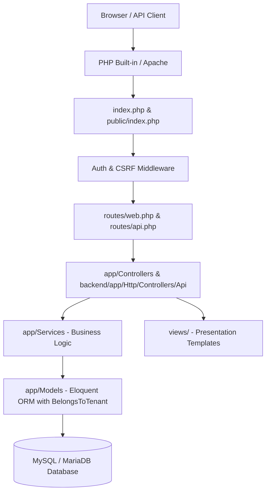

# WTSBill ERP — Architecture Specification

**Principal PHP Architect:** Antigravity Architect  
**Architecture Style:** Layered MVC / Service-Domain Pattern  
**Target Environment:** PHP 8.0+ / MySQL 8.0+ / MariaDB 10.4+  

---

## 1. Architectural Overview

## 2. Tier Responsibility

* **Presentation Layer (`views/`):** Contains SSR HTML and minimal presentation helpers (`e()`, `format_currency()`, `format_date()`). Zero raw SQL queries or business computations are allowed in templates.
* **Routing Layer (`routes/`):** Maps incoming clean URLs and versioned REST endpoints (`/api/v1/...`).
* **HTTP Controller Layer (`app/Controllers/`):** Validates input using `App\Validators\Validator`, coordinates service calls, and returns view models or JSON responses.
* **Domain Service Layer (`app/Services/`):** Encapsulates business transactions (Invoice posting, tax computation, stock movements, double-entry journal creation).
* **Persistence Layer (`app/Models/`):** Eloquent models with global tenant scope (`BelongsToTenant`) enforcing `company_id` isolation on every query.
* **Database Layer (`database/`):** 161 InnoDB tables with strict `DECIMAL(15, 2)` / `DECIMAL(15, 4)` precision on all monetary columns.
